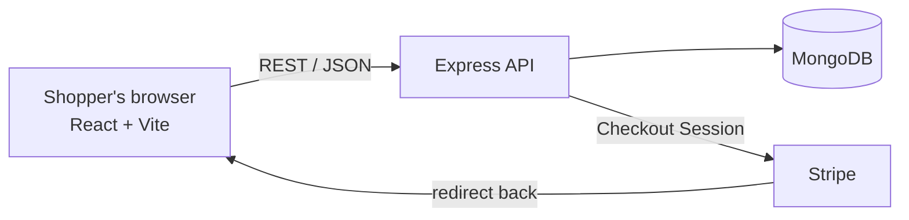

# ShopSphere

**A full-stack e-commerce web app built with the MERN stack.**
Browse products, filter and search, manage a shopping cart, sign in, and check out with Stripe or a built-in demo payment, all in a clean white and dark-blue interface.

> CodeSoft Internship · Task 1: E-Commerce Website

---

## Overview

ShopSphere is a complete online store. Shoppers can discover products with search and filters, add items to a cart that survives page reloads, create an account, enter a shipping address and pay. Every order is saved to MongoDB with a snapshot of what was bought, at what price, and where it ships.

The goal of the project is to show a realistic end-to-end flow: a React front end talking to a REST API, with authentication, server-side validation of prices and stock, and a payment integration, instead of a static storefront.

## Features

**Shopping**
- Product catalogue with images, brand, category, rating and live stock
- Full-text search across name, description and brand
- Filters: category, brand, price range and minimum rating
- Sorting: newest, price (low to high and high to low), top rated
- Pagination and one-click category chips
- Product detail page with quantity selector and "Buy now"

**Cart**
- Add, remove and change quantities, limited to available stock
- Cart is saved in the browser, so it survives reloads
- Live subtotal, shipping and total
- Free shipping on orders of ₹999 and above, otherwise a flat ₹49

**Accounts**
- Register and log in with email and password
- Passwords hashed with bcrypt, sessions use signed JWTs (7-day expiry)
- Protected routes: checkout, order history and order pages require login
- **Email suggestions on the login and sign-up form.** Emails you used before on the device appear first. After you type `@`, common providers (Gmail, Outlook, Yahoo, iCloud and more) are completed for you. Works with arrow keys, Enter, Tab and Esc.

**Checkout and orders**
- Shipping address form
- Prices, stock and totals are recalculated on the server from the database. The browser's numbers are never trusted
- Payment through Stripe Checkout, or a demo payment when no Stripe key is set
- Order confirmation page and "My orders" history
- Stock is reduced only after a payment succeeds

**Admin API**
- Create, update and delete products (users with `isAdmin: true`)

**UI**
- White and dark-blue theme with bold typography
- Fully responsive: filters collapse on mobile, layouts stack on small screens
- Keyboard-friendly, visible focus states, reduced-motion support

## Tech stack

| Layer | Technology |
|---|---|
| Front end | React 18, React Router 6, Vite 5, plain CSS (no UI framework) |
| Back end | Node.js, Express 4 |
| Database | MongoDB with Mongoose 8 |
| Auth | JSON Web Tokens (`jsonwebtoken`), `bcryptjs` |
| Payments | Stripe Checkout (`stripe` SDK), with a demo fallback |
| Tooling | npm scripts, GitLab CI, Netlify and Render deploy configs |

## How it works



**Checkout flow**

1. The shopper fills the cart and signs in.
2. The client sends only product IDs, quantities and the shipping address to `POST /api/orders`.
3. The server loads the products, checks stock, calculates the totals and saves a `pending` order.
4. `POST /api/orders/:id/pay` either creates a Stripe Checkout session (the client redirects to Stripe) or, in demo mode, marks the order paid.
5. After Stripe redirects back, the client calls `POST /api/orders/:id/confirm`. The server asks Stripe whether the session is paid, marks the order `paid` and reduces stock.

## Project structure

```
.
├── client/                     React app (Vite)
│   └── src/
│       ├── components/         Navbar, ProductCard, EmailInput
│       ├── context/            AuthContext, CartContext
│       ├── pages/              Shop, ProductPage, CartPage, Login,
│       │                       Checkout, OrderPage, Orders
│       ├── api.js              fetch wrapper and currency formatter
│       ├── mockApi.js          in-browser fake API (demo mode only)
│       └── styles.css          theme and components
├── server/                     Express API
│   └── src/
│       ├── models/             User, Product, Order
│       ├── routes/             auth, products, orders
│       ├── middleware/         JWT auth and admin guard
│       ├── seed.js             sample products and demo users
│       └── index.js            app entry point
├── netlify.toml                front-end deploy config
├── render.yaml                 API deploy config
└── .gitlab-ci.yml              CI build and GitLab Pages deploy
```

## Getting started

**Requirements:** Node.js 18 or newer, and a MongoDB database (local install or a free MongoDB Atlas cluster).

```bash
# 1. Clone and install both apps
git clone https://github.com/hargun1212k/CODESOFT_TASKNO1.git
cd CODESOFT_TASKNO1
npm run install:all

# 2. Configure the server
cp server/.env.example server/.env
# edit server/.env and set MONGO_URI and JWT_SECRET

# 3. Load sample data (20 products and 2 users)
npm run seed

# 4. Start the API (port 5000) and the front end (port 5173)
npm run dev:server
npm run dev:client      # run this in a second terminal
```

Open **http://localhost:5173**.

**Demo accounts created by the seed script**

| Role | Email | Password |
|---|---|---|
| Customer | `demo@shop.com` | `demo1234` |
| Admin | `admin@shop.com` | `admin123` |

Change or remove these accounts before any real deployment.

**Useful scripts**

| Command | What it does |
|---|---|
| `npm run install:all` | Installs server and client dependencies |
| `npm run seed` | Resets products and creates demo users |
| `npm run dev:server` | Starts the API with auto-restart |
| `npm run dev:client` | Starts the Vite dev server (proxies `/api` to port 5000) |
| `npm run build` | Production build of the front end into `client/dist` |

## Environment variables

**`server/.env`**

| Variable | Required | Description |
|---|---|---|
| `MONGO_URI` | yes | MongoDB connection string |
| `JWT_SECRET` | yes | Long random string used to sign tokens |
| `PORT` | no | API port, default `5000` |
| `CLIENT_URL` | no | Allowed front-end origin(s) for CORS, comma separated. Also used for Stripe return URLs |
| `STRIPE_SECRET_KEY` | no | Stripe secret key (`sk_test_...`). Leave empty for demo payments |

**`client/.env`**

| Variable | Required | Description |
|---|---|---|
| `VITE_API_URL` | in production | Base URL of the deployed API, for example `https://shopsphere-api.onrender.com`. Leave empty locally |

## Payments

- **With `STRIPE_SECRET_KEY` set:** the shopper is redirected to Stripe's hosted checkout page (currency INR). Use the test card `4242 4242 4242 4242` with any future expiry and any CVC.
- **Without a key:** a demo payment marks the order as paid immediately and no card is charged. This is only for development and demos. Add a Stripe key before accepting real orders.

## API reference

Base path: `/api`. Routes marked "Login" need an `Authorization: Bearer <token>` header. Routes marked "Admin" also need a user with `isAdmin: true`.

**Auth**

| Method | Route | Access | Description |
|---|---|---|---|
| POST | `/auth/register` | Public | Create an account, returns the user and a JWT |
| POST | `/auth/login` | Public | Log in, returns the user and a JWT |
| GET | `/auth/me` | Login | Current user |

**Products**

| Method | Route | Access | Description |
|---|---|---|---|
| GET | `/products` | Public | List products. Query: `search`, `category`, `brand`, `minPrice`, `maxPrice`, `minRating`, `sort` (`newest`, `price-asc`, `price-desc`, `rating`), `page`, `limit` |
| GET | `/products/meta/filters` | Public | Available categories, brands and price bounds |
| GET | `/products/:id` | Public | One product |
| POST | `/products` | Admin | Create a product |
| PUT | `/products/:id` | Admin | Update a product |
| DELETE | `/products/:id` | Admin | Delete a product |

**Orders**

| Method | Route | Access | Description |
|---|---|---|---|
| POST | `/orders` | Login | Create an order from `items` and `shipping` |
| POST | `/orders/:id/pay` | Login | Start payment (Stripe session URL) or complete a demo payment |
| POST | `/orders/:id/confirm` | Login | Verify a Stripe session after redirect |
| GET | `/orders/mine` | Login | The user's orders, newest first |
| GET | `/orders/:id` | Login | One of the user's orders |

**Health:** `GET /api/health` returns `{ ok: true, payments: "stripe" | "demo" }`.

## Data models

- **User:** `name`, `email` (unique), `password` (hashed), `isAdmin`
- **Product:** `name`, `description`, `price`, `category`, `brand`, `image`, `rating`, `stock`, with a text index on name, description and brand
- **Order:** `user`, `items[]` (product, name, image, price and quantity at purchase time), `shipping`, `itemsTotal`, `shippingFee`, `total`, `paymentMethod`, `stripeSessionId`, `status` (`pending`, `paid`, `shipped`, `cancelled`), `paidAt`

## Security notes

- Passwords are hashed with bcrypt and never returned by the API.
- Protected routes verify the JWT and reload the user on every request.
- Order totals come from database prices, so a modified browser request cannot lower a price.
- Stock is checked when the order is created and reduced only when it is paid.
- CORS only accepts the origins listed in `CLIENT_URL`.
- Keep `.env` out of git (it is already in `.gitignore`) and use a long random `JWT_SECRET`.

## Deployment

All of these have a free tier.

1. **Database.** Create a free MongoDB Atlas cluster, allow network access, copy the connection string, and run `npm run seed` once with it in `server/.env`.
2. **API.** On Render, choose *New → Blueprint* and select this repository (it uses `render.yaml`). Set `MONGO_URI` and `CLIENT_URL`.
3. **Front end.** Pick one:
   - **Netlify:** import the repository (it uses `netlify.toml`) and set `VITE_API_URL` to your API address.
   - **GitLab Pages:** set `VITE_API_URL` as a CI/CD variable. The `pages` job in `.gitlab-ci.yml` publishes on every push to the default branch.
4. Set `CLIENT_URL` on the API to the final front-end URL.

Render's free plan sleeps when idle, so the first request after a break can take about 30 seconds.

## Demo mode

The front end can run without any backend, using an in-browser fake API with sample products. This is handy for quick previews and screenshots.

```bash
cd client
VITE_MOCK=1 npm run dev
```

Orders and stock reset on every reload in this mode. Normal builds do not include the fake API.

## Roadmap

Ideas for taking this further:

- Admin dashboard in the UI (products and order status)
- Stripe webhook for payment confirmation, in addition to the redirect check
- Product reviews, wishlist and image uploads
- Password reset by email
- Rate limiting and security headers (`helmet`)
- Automated tests for the API and key user flows

## Prototype

**Local link:** http://localhost:5173

This address works on your own computer once the front end is running (`npm run dev:client`, or the demo mode below). Log in with `demo@shop.com` and `demo1234`.

**Hosted demo:** https://hargun1212k.github.io/CODESOFT_TASKNO1/

A demo-mode build of the front end with sample products. It needs no backend, and orders reset when the page reloads.

---

Built by **Hargun** as part of the CodeSoft internship.
